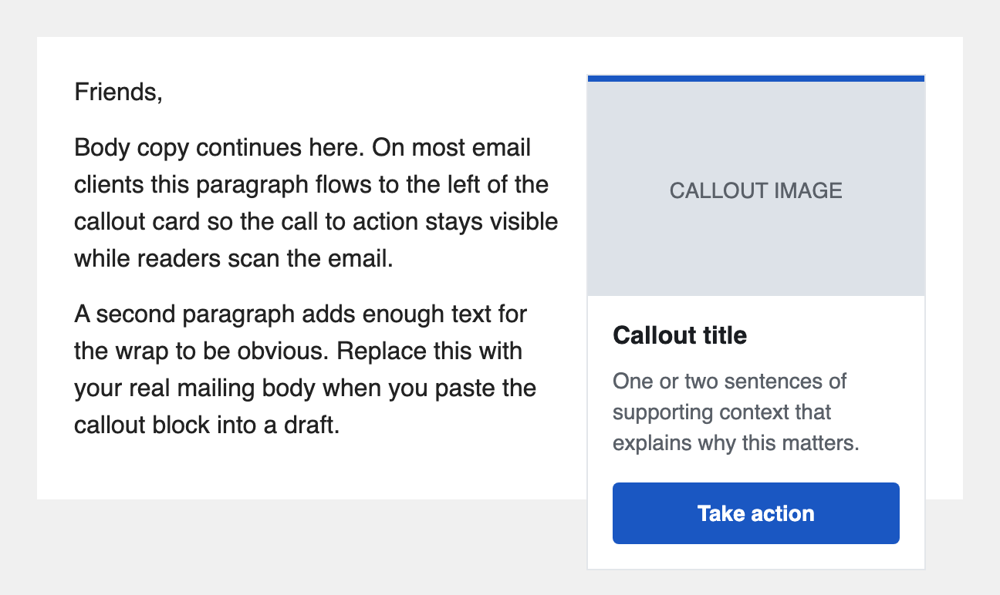

# Callout box

## What it is

A right-aligned card with an image, title, short body, and button. Drop it above your body paragraphs and the CTA stays visible while readers scan the email — no scrolling required to find the action.



---

## Tier 1: Paste and go

Copy the HTML below and paste it into your ActionKit mailing **above** the paragraphs you want the body copy to wrap around. Edit the six things called out in the comments.

### The HTML

See [`1-basic.html`](./1-basic.html) for the copy-paste source.

### What to edit

- **Image URL** — replace `https://example.org/callout.png` with a hosted image. 220×220px (or 440×440 for retina) is the right shape. Use a CDN your team controls.
- **Image alt text** — replace `Callout image` with a short description of the image. Email clients show this when images are blocked.
- **Title** — replace `Callout title` with the headline (1 line works best).
- **Body text** — replace the placeholder sentence with 1–2 short sentences of context. If you don't need body text, delete the whole `<!-- Body -->` row.
- **Button label + URL** — find `Take action` and `https://example.org` and replace both with your CTA. Each appears twice (once in the VML block for Outlook, once in the `<a>` tag).
- **Brand color** — replace `#1a57c2` with your brand color. It appears 3 times: the top accent bar, the VML `fillcolor`, and the `<a>` background.

### Where to paste it

In the AK Compose screen, paste the block immediately **before** the paragraph where you want body copy to start wrapping around it:

```html
[paste callout-box HTML here]
<p>Friends,</p>
<p>This is your first body paragraph. On Gmail, Apple Mail, iOS Mail, and Outlook.com, this text will flow to the left of the callout card...</p>
<p>This is the second paragraph...</p>
```

---

## Tier 2: Let your team edit it from the AK Compose screen

### Why you'd want this

Tier 1 means anyone updating the callout has to edit HTML in 3+ spots. Tier 2 wires the title, body, image, button, and color to ActionKit Custom Mailing Fields. Your fundraising or comms team types into 8 simple text boxes on the Compose screen — no HTML editing.

### One-time setup: create these Custom Mailing Fields

Your AK admin creates these once in **Mailings tab → Custom Mailing Fields → Add custom mailing field**:

| Field name | Type | Suggested default |
|---|---|---|
| `callout_title` | Text | `Take action today` |
| `callout_body` | Text | `Your support keeps this campaign moving.` |
| `callout_image_url` | Text | `https://yourorg.org/img/callout-default.png` |
| `callout_image_alt` | Text | `Image describing the callout` |
| `callout_button_label` | Text | `Donate` |
| `callout_button_url` | Text | `https://yourorg.actionkit.com/donate/general/` |
| `callout_color` | Text | `#1a57c2` |
| `callout_text_color` | Text | `#ffffff` |

**Field name tip:** AK field names are case-sensitive and must match exactly what's in the HTML.

### The HTML

See [`2-with-cmfs.html`](./2-with-cmfs.html) for the copy-paste source.

---

## Known compatibility

- **Gmail (web + apps), Apple Mail, iOS Mail, Outlook.com** — full text-wrap. Body paragraphs flow to the left of the callout.
- **Outlook Windows** — the callout sits at top-right of the parent cell and body copy starts below it. Not ideal but predictable. The card itself (accent, image, title, body, button) renders correctly via VML.
- **Mobile (Apple Mail, Gmail apps, Outlook iOS, Samsung Mail)** — the embedded media query stacks the callout above the body copy at widths under 480px.
- **Gmail Web on phone** — Gmail Web strips the `<style>` block, so the callout stays right-aligned at 220px even on narrow viewports. Readable but cramped. Acceptable known limitation; the much more common Gmail app honors the media query.
- **Image blocking** — alt text shows; the card border and brand accent still render. The title, body, and button remain readable.
- **Dark mode** — card uses white background, dark text, brand-color accent + button. Most clients respect the inline styles. Aggressive dark-mode inversion in some Samsung/Outlook iOS builds may flip the card to a dark surface; title and body stay legible.

---

## Tested on

| Client | Light | Dark | Notes |
|---|---|---|---|
| Apple Mail macOS | — | — | not yet tested |
| Apple Mail iOS | — | — | not yet tested |
| Gmail web (Chrome) | — | — | not yet tested |
| Gmail iOS app | — | — | not yet tested |
| Gmail Android app | — | — | not yet tested |
| Outlook web | — | — | not yet tested |
| Outlook iOS app | — | — | not yet tested |
| Yahoo Mail web | — | — | not yet tested |
| Proton Mail web | — | — | not yet tested |
| Outlook Windows desktop | — | — | not yet tested (requires Litmus or Windows VM) |
| Samsung Mail | — | — | not yet tested (requires Android device) |

Last verified: never. See [`tests/QA-PROCEDURE.md`](../../tests/QA-PROCEDURE.md) for how to fill this in.
