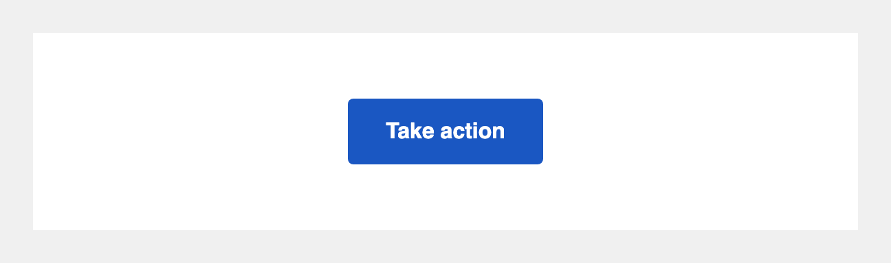

# CTA Button

## What it is

A single call-to-action button that renders correctly in Outlook (Windows), Gmail, Apple Mail, and on mobile — no images, no CSS tricks, just a solid-colored table-based button your recipients can tap even with images blocked.



---

## Tier 1: Paste and go

Copy the HTML below, paste it into your ActionKit mailing body, and edit the three spots called out in the comments.

### The HTML

```html
<!--
  CTA Button — Tier 1: Paste and go
  Three things you typically edit:
    1. Button label: change "Take action" to your call to action
    2. Button URL: replace https://example.org with your target link
    3. Background color: replace #1a57c2 with your brand color (update in both spots marked below)
-->
<table role="presentation" cellspacing="0" cellpadding="0" border="0" align="center" style="margin: 24px auto;">
  <tr>
    <td align="center">
      <!--[if mso]>
      <v:roundrect xmlns:v="urn:schemas-microsoft-com:vml" xmlns:w="urn:schemas-microsoft-com:office:word"
        href="https://example.org"
        style="height:48px; v-text-anchor:middle; width:200px;"
        arcsize="8%"
        stroke="f"
        fillcolor="#1a57c2">
        <w:anchorlock/>
        <center style="color:#ffffff; font-family:Helvetica,Arial,sans-serif; font-size:16px; font-weight:bold;">Take action</center>
      </v:roundrect>
      <![endif]-->
      <!--[if !mso]><!-->
      <a href="https://example.org"
         target="_blank"
         rel="noopener"
         style="
           background-color: #1a57c2;
           border-radius: 4px;
           color: #ffffff;
           display: inline-block;
           font-family: Helvetica, Arial, sans-serif;
           font-size: 16px;
           font-weight: bold;
           line-height: 48px;
           min-height: 48px;
           padding: 0 28px;
           text-align: center;
           text-decoration: none;
           -webkit-text-size-adjust: none;
           mso-hide: all;
         ">Take action</a>
      <!--<![endif]-->
    </td>
  </tr>
</table>
```

Copy-paste source: [`1-basic.html`](./1-basic.html)

### What to edit

- **Button label** — find `Take action` and replace it with your call to action. It appears twice: once in the VML block (for Outlook) and once in the `<a>` tag. Change both.
- **Button URL** — find `https://example.org` and replace it with your link. It appears twice: once in `href="https://example.org"` in the VML block and once in the `<a>` tag.
- **Background color** — find `#1a57c2` and replace it with your brand color. It appears in `fillcolor="#1a57c2"` (Outlook) and `background-color: #1a57c2` (everyone else). If you change the background, also update `color:#ffffff` in the VML center tag and `color: #ffffff` in the `<a>` style if you need a different text color.

---

## Tier 2: Let your team edit it from the AK Compose screen

### Why you'd want this

With Tier 1, anyone who wants to change the button label, URL, or color has to open the HTML and find the right spots — not ideal if you have non-technical staff sending mailings. Tier 2 wires those four values to ActionKit Custom Mailing Fields (CMFs). Once set up, your team sees simple text boxes on the Compose screen and never touches the HTML.

### One-time setup: create these Custom Mailing Fields

Your AK admin creates these once in **Mailings tab → Custom Mailing Fields → Add custom mailing field**. After that, any mailing using this block will show these fields on the Compose screen.

| Field name | Type | Suggested default |
|---|---|---|
| `cta_button_label` | Text | `Take action` |
| `cta_button_url` | Text | `https://yourorg.actionkit.com` |
| `cta_button_bg_color` | Text | `#1a57c2` |
| `cta_button_text_color` | Text | `#ffffff` |

**Field name tip:** AK field names are case-sensitive and must match exactly what's in the HTML. Use the names above as-is.

### The HTML

```html
<!--
  CTA Button — Tier 2: Wired to Custom Mailing Fields
  Your team edits these four fields from the AK Compose screen:
    cta_button_label     — the button text
    cta_button_url       — the link URL
    cta_button_bg_color  — button background color (hex, e.g. #1a57c2)
    cta_button_text_color — button text color (hex, e.g. #ffffff)
  See README.md for one-time admin setup instructions.
-->
<table role="presentation" cellspacing="0" cellpadding="0" border="0" align="center" style="margin: 24px auto;">
  <tr>
    <td align="center">
      <!--[if mso]>
      <v:roundrect xmlns:v="urn:schemas-microsoft-com:vml" xmlns:w="urn:schemas-microsoft-com:office:word"
        href="{{ custom_fields.cta_button_url }}"
        style="height:48px; v-text-anchor:middle; width:200px;"
        arcsize="8%"
        stroke="f"
        fillcolor="{{ custom_fields.cta_button_bg_color }}">
        <w:anchorlock/>
        <center style="color:{{ custom_fields.cta_button_text_color }}; font-family:Helvetica,Arial,sans-serif; font-size:16px; font-weight:bold;">{{ custom_fields.cta_button_label }}</center>
      </v:roundrect>
      <![endif]-->
      <!--[if !mso]><!-->
      <a href="{{ custom_fields.cta_button_url }}"
         target="_blank"
         rel="noopener"
         style="
           background-color: {{ custom_fields.cta_button_bg_color }};
           border-radius: 4px;
           color: {{ custom_fields.cta_button_text_color }};
           display: inline-block;
           font-family: Helvetica, Arial, sans-serif;
           font-size: 16px;
           font-weight: bold;
           line-height: 48px;
           min-height: 48px;
           padding: 0 28px;
           text-align: center;
           text-decoration: none;
           -webkit-text-size-adjust: none;
           mso-hide: all;
         ">{{ custom_fields.cta_button_label }}</a>
      <!--<![endif]-->
    </td>
  </tr>
</table>
```

Copy-paste source: [`2-with-cmfs.html`](./2-with-cmfs.html)

---

## Known compatibility

- **Outlook Windows** — uses MSO VML conditional comments (`<!--[if mso]>`) so Outlook renders the button with the correct height and background color instead of falling back to a plain blue underlined link.
- **Gmail mobile** — table-based layout survives Gmail's CSS stripping; inline styles render correctly.
- **Apple Mail** — renders as expected; `border-radius` is honored.
- **Dark mode** — button background and text colors are set explicitly via inline styles. Most email clients respect these in dark mode. Some aggressive dark-mode overrides (Outlook on iOS, some Samsung Mail builds) may invert colors; this is a known limitation of inline-style-only buttons.

---

## Tested on

Pending QA — will be filled in after testing.
