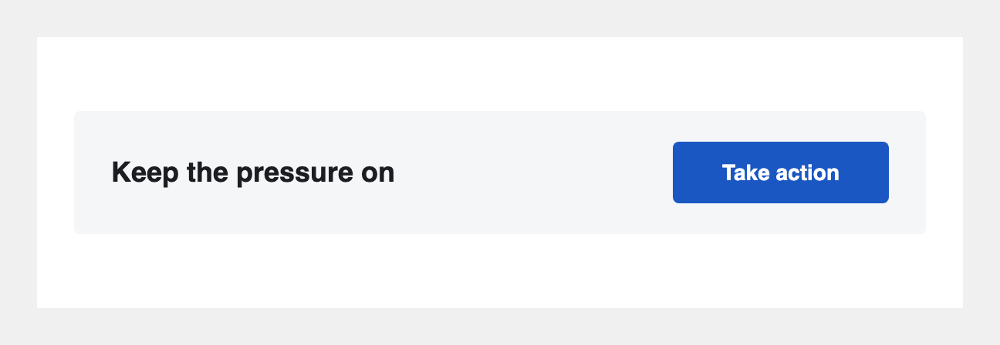

# CTA line

## What it is

A horizontal headline + button strip — lighter visual weight than a full hero CTA, good for mid-body "remind me" or secondary asks. Headline sits left, button sits right on desktop; both stack on mobile.

---

## Tier 1: Paste and go

Copy the HTML below, paste it into your ActionKit mailing body where you want the strip to appear, and edit the five things called out in the comments.

### The HTML

See [`1-basic.html`](./1-basic.html) for the copy-paste source.

### What to edit

- **Headline** — replace `Keep the pressure on` with your line. One short sentence works best.
- **Button label + URL** — find `Take action` and `https://example.org` and replace both. Each appears twice (VML block for Outlook + `<a>` tag for everyone else).
- **Strip background** — replace `#f5f6f8` with your color, or set to `transparent` for no fill.
- **Button color** — replace `#1a57c2` in `fillcolor` (Outlook) and `background-color` (everyone else).

---

## Tier 2: Let your team edit it from the AK Compose screen

### Why you'd want this

Tier 1 means your team edits HTML to change the headline or button per mailing. Tier 2 wires the seven values to ActionKit Custom Mailing Fields. Your team types into 7 boxes on the Compose screen — no HTML editing.

### One-time setup: create these Custom Mailing Fields

Your AK admin creates these once in **Mailings tab → Custom Mailing Fields → Add custom mailing field**:

| Field name | Type | Suggested default |
|---|---|---|
| `cta_line_text` | Text | `Keep the pressure on` |
| `cta_line_button_label` | Text | `Take action` |
| `cta_line_button_url` | Text | `https://yourorg.actionkit.com/...` |
| `cta_line_bg_color` | Text | `#f5f6f8` |
| `cta_line_text_color` | Text | `#1a1d21` |
| `cta_line_button_bg_color` | Text | `#1a57c2` |
| `cta_line_button_text_color` | Text | `#ffffff` |

**Field name tip:** AK field names are case-sensitive and must match exactly what's in the HTML.

### The HTML

See [`2-with-cmfs.html`](./2-with-cmfs.html) for the copy-paste source.

---

## Known compatibility

- **Gmail (web + apps), Apple Mail, iOS Mail, Outlook.com** — headline + button side-by-side on desktop, stacked on mobile via media query.
- **Outlook Windows** — VML keeps the button rendering correctly; headline and button stay side-by-side via table cells.
- **Gmail Web on phone** — Gmail Web strips the `<style>` block, so the cells stay side-by-side and the headline + button may be cramped at narrow widths. Acceptable known limitation.
- **Dark mode** — strip bg, headline color, button bg, and button text are all set inline. Most clients respect them; aggressive dark-mode override in some Outlook iOS / Samsung Mail builds may shift the strip color.

---

## Tested on

See [`tests/qa-results.md`](../../tests/qa-results.md) for the current QA matrix across every block and client. Single source of truth — this section deliberately doesn't duplicate it.

**Latest full QA run:** never. See [`tests/QA-PROCEDURE.md`](../../tests/QA-PROCEDURE.md) for how to run one.
