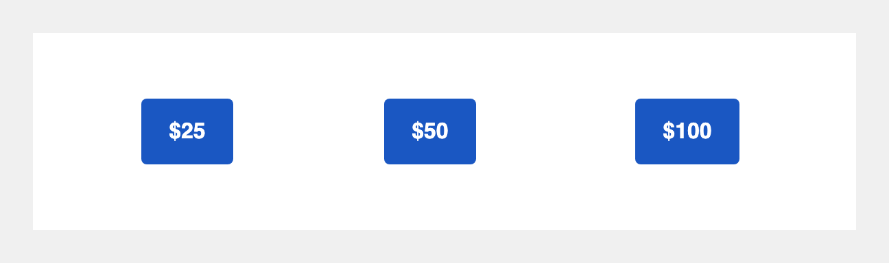

# Donation array (3 buttons)

## What it is

A row of three donation buttons that links each one to an ActionKit donation page with the amount pre-filled. All three buttons use the bulletproof table+VML pattern, so they render correctly in Outlook Windows, Gmail, Apple Mail, and on mobile even with images blocked.



---

## Tier 1: Paste and go

### The HTML

```html
<!--
  Donation Array — Tier 1: Paste and go
  Three edit points:
    1. Page slug: replace YOUR_DONATION_PAGE in 3 places (one per button href)
    2. Amounts: change the &amount= URL parameter AND the visible label for each button
    3. Subdomain: replace yourorg.actionkit.com with your org's AK subdomain (3 places)
-->
<table role="presentation" cellspacing="0" cellpadding="0" border="0" align="center" style="margin: 24px auto; width: 100%; max-width: 600px;">
  <tr>

    <!-- Button 1: $25 -->
    <td align="center" valign="top" style="padding: 0 4px;">
      <!--[if mso]>
      <v:roundrect xmlns:v="urn:schemas-microsoft-com:vml" xmlns:w="urn:schemas-microsoft-com:office:word"
        href="https://yourorg.actionkit.com/donate/YOUR_DONATION_PAGE/?amount=25&amp;prefill=1"
        style="height:48px; v-text-anchor:middle; width:180px;"
        arcsize="8%"
        stroke="f"
        fillcolor="#1a57c2">
        <w:anchorlock/>
        <center style="color:#ffffff; font-family:Helvetica,Arial,sans-serif; font-size:16px; font-weight:bold;">$25</center>
      </v:roundrect>
      <![endif]-->
      <!--[if !mso]><!-->
      <a href="https://yourorg.actionkit.com/donate/YOUR_DONATION_PAGE/?amount=25&amp;prefill=1"
         target="_blank"
         rel="noopener"
         style="
           background-color: #1a57c2;
           border-radius: 4px;
           color: #ffffff;
           display: inline-block;
           font-family: Helvetica, Arial, sans-serif;
           font-size: 16px;
           font-weight: bold;
           line-height: 48px;
           min-height: 48px;
           padding: 0 20px;
           text-align: center;
           text-decoration: none;
           -webkit-text-size-adjust: none;
           mso-hide: all;
         ">$25</a>
      <!--<![endif]-->
    </td>

    <!-- Button 2: $50 -->
    <td align="center" valign="top" style="padding: 0 4px;">
      <!--[if mso]>
      <v:roundrect xmlns:v="urn:schemas-microsoft-com:vml" xmlns:w="urn:schemas-microsoft-com:office:word"
        href="https://yourorg.actionkit.com/donate/YOUR_DONATION_PAGE/?amount=50&amp;prefill=1"
        style="height:48px; v-text-anchor:middle; width:180px;"
        arcsize="8%"
        stroke="f"
        fillcolor="#1a57c2">
        <w:anchorlock/>
        <center style="color:#ffffff; font-family:Helvetica,Arial,sans-serif; font-size:16px; font-weight:bold;">$50</center>
      </v:roundrect>
      <![endif]-->
      <!--[if !mso]><!-->
      <a href="https://yourorg.actionkit.com/donate/YOUR_DONATION_PAGE/?amount=50&amp;prefill=1"
         target="_blank"
         rel="noopener"
         style="
           background-color: #1a57c2;
           border-radius: 4px;
           color: #ffffff;
           display: inline-block;
           font-family: Helvetica, Arial, sans-serif;
           font-size: 16px;
           font-weight: bold;
           line-height: 48px;
           min-height: 48px;
           padding: 0 20px;
           text-align: center;
           text-decoration: none;
           -webkit-text-size-adjust: none;
           mso-hide: all;
         ">$50</a>
      <!--<![endif]-->
    </td>

    <!-- Button 3: $100 -->
    <td align="center" valign="top" style="padding: 0 4px;">
      <!--[if mso]>
      <v:roundrect xmlns:v="urn:schemas-microsoft-com:vml" xmlns:w="urn:schemas-microsoft-com:office:word"
        href="https://yourorg.actionkit.com/donate/YOUR_DONATION_PAGE/?amount=100&amp;prefill=1"
        style="height:48px; v-text-anchor:middle; width:180px;"
        arcsize="8%"
        stroke="f"
        fillcolor="#1a57c2">
        <w:anchorlock/>
        <center style="color:#ffffff; font-family:Helvetica,Arial,sans-serif; font-size:16px; font-weight:bold;">$100</center>
      </v:roundrect>
      <![endif]-->
      <!--[if !mso]><!-->
      <a href="https://yourorg.actionkit.com/donate/YOUR_DONATION_PAGE/?amount=100&amp;prefill=1"
         target="_blank"
         rel="noopener"
         style="
           background-color: #1a57c2;
           border-radius: 4px;
           color: #ffffff;
           display: inline-block;
           font-family: Helvetica, Arial, sans-serif;
           font-size: 16px;
           font-weight: bold;
           line-height: 48px;
           min-height: 48px;
           padding: 0 20px;
           text-align: center;
           text-decoration: none;
           -webkit-text-size-adjust: none;
           mso-hide: all;
         ">$100</a>
      <!--<![endif]-->
    </td>

  </tr>
</table>
```

Copy-paste source: [`1-basic.html`](./1-basic.html)

### What to edit

- **Page slug** — find `YOUR_DONATION_PAGE` and replace it with your AK donation page's slug. It appears once per button (3 total). The slug is the page name you set when creating the donation page in AK admin.
- **Amounts** — for each button, change the `&amount=` value in the URL AND the visible label (e.g., `$25`). Each appears twice per button: once in the VML block for Outlook and once in the `<a>` tag.
- **Subdomain** — replace `yourorg.actionkit.com` with your org's AK subdomain. Appears 3 times, one per button.

---

## Tier 2: Let your team set the ask amounts from AK Compose

### Why you'd want this

With Tier 1, anyone changing the ask ladder has to edit HTML. Tier 2 wires amounts and the page slug to ActionKit Custom Mailing Fields (CMFs). Your fundraising team sets them on the Compose screen each mailing — no HTML needed.

### One-time setup: create these Custom Mailing Fields

Your AK admin creates these once under **Mailings tab → Custom Mailing Fields → Add custom mailing field**.

| Field name | Type | Suggested default |
|---|---|---|
| `donation_amount_1` | Text | `25` |
| `donation_amount_2` | Text | `50` |
| `donation_amount_3` | Text | `100` |
| `donation_page_slug` | Text | `your-donation-page` |

Store amounts as plain integers (no dollar sign). The `$` is hard-coded in the HTML.

### The HTML

```html
<!--
  Donation Array — Tier 2: Wired to Custom Mailing Fields
  Your team edits these fields from the AK Compose screen:
    donation_amount_1    — first button amount (integer, e.g. 25)
    donation_amount_2    — second button amount (integer, e.g. 50)
    donation_amount_3    — third button amount (integer, e.g. 100)
    donation_page_slug   — AK donation page name (e.g. give-2026-spring)
  See README.md for one-time admin setup instructions.
-->
```

Copy-paste source: [`2-with-cmfs.html`](./2-with-cmfs.html)

### Per-mailing workflow

Each time you send a fundraising mailing, your team opens the mailing's Compose screen in AK, finds the four CMF fields, and types in the ask amounts and the donation page slug for that campaign. The HTML block pulls those values in automatically — no template editing required.

---

## Tier 3: Personalize to each recipient

### What it does

Each recipient sees a row of three donation buttons built from their own highest prior gift across all currencies (`donations.highest_previous_all`). Button 1 matches their prior amount exactly; Button 2 is 1.5x that amount; Button 3 is 2x. Amounts are rounded to integers.

Recipients who have never donated are handled cleanly: the `` tag wraps the entire block, so AK suppresses it entirely for non-donors rather than rendering a broken `$` button.

### Who sees what

| Recipient's highest prior gift | Button 1 | Button 2 (1.5x) | Button 3 (2x) |
|---|---|---|---|
| $25 | $25 | $38 | $50 |
| $100 | $100 | $150 | $200 |
| $500 | $500 | $750 | $1,000 |
| (no prior gift) | block suppressed — buttons do not appear | | |

### The HTML

```html

<!--
  Donation Array — Tier 3: Personalized to donor history
  Each recipient sees three buttons built from their highest prior donation:
    Button 1: exact prior amount
    Button 2: 1.5x prior amount (rounded to integer)
    Button 3: 2x prior amount (rounded to integer)

  Recipients with no prior donation history are suppressed cleanly by the
   tag above — AK will not render this block for them.

  One CMF required:
    donation_page_slug — AK donation page name (reuse from Tier 2 if already created)

  No amount CMFs needed — amounts are computed from donations.highest_previous_all.
-->
<table role="presentation" ...>
  <tr>
    <td><!-- Button 1: {{ donations.highest_previous_all|floatformat:"0" }} --></td>
    <td><!-- Button 2: {{ donations.highest_previous_all|multiply:"1.5"|floatformat:"0" }} --></td>
    <td><!-- Button 3: {{ donations.highest_previous_all|multiply:"2"|floatformat:"0" }} --></td>
  </tr>
</table>

```

Copy-paste source: [`3-personalized.html`](./3-personalized.html)

### Setup

The only CMF you need is `donation_page_slug` — the same one from Tier 2. If you already created it, no additional admin setup is required. Tier 3 computes amounts from AK's built-in `donations.highest_previous_all` variable, which AK populates automatically from each recipient's donation history. No custom user fields.

### Alternative: use AK's native suggested ask

If your org already has Suggested Ask Rules configured on a donation landing page, AK's `{{ suggested_ask }}` variable returns the calculated ask for each recipient using those configured ladders. Example button label:

```html
${{ suggested_ask }}
```

Tradeoff: AK's Suggested Ask feature is more sophisticated — it lets you configure exact ask ladders per donation page and handles rounding the way your org wants. But it requires upfront setup in AK admin. The multiplier approach this block uses (1x / 1.5x / 2x) is zero-setup and works out of the box. Pick whichever fits your workflow.

AK's Suggested Ask documentation: [https://roboticdogs.actionkit.com/docs/manual/guide/mailings.html#suggested-ask](https://roboticdogs.actionkit.com/docs/manual/guide/mailings.html#suggested-ask)

### Testing before you send

- Send a proof to someone known to have a prior donation — they should see their personalized ladder with the correct multiplied amounts.
- Send a proof to someone who has never donated — the block should suppress entirely; the proof should render without any donation buttons from this block.
- Use AK's proof tool with a specific test user to preview personalization before sending to the full list.

---

## Known compatibility

- **Outlook Windows** — MSO VML conditional comments (`<!--[if mso]>`) render each button with correct height and background color.
- **Gmail mobile** — table-based layout survives Gmail's CSS stripping; inline styles render correctly.
- **Apple Mail** — renders as expected; `border-radius` is honored.
- **Dark mode** — button background and text colors are set explicitly via inline styles. Most email clients respect these. Some aggressive dark-mode overrides (Outlook on iOS, some Samsung Mail builds) may invert colors; this is a known limitation of inline-style-only buttons.

---

## Tested on

Pending QA — will be filled in after testing.
