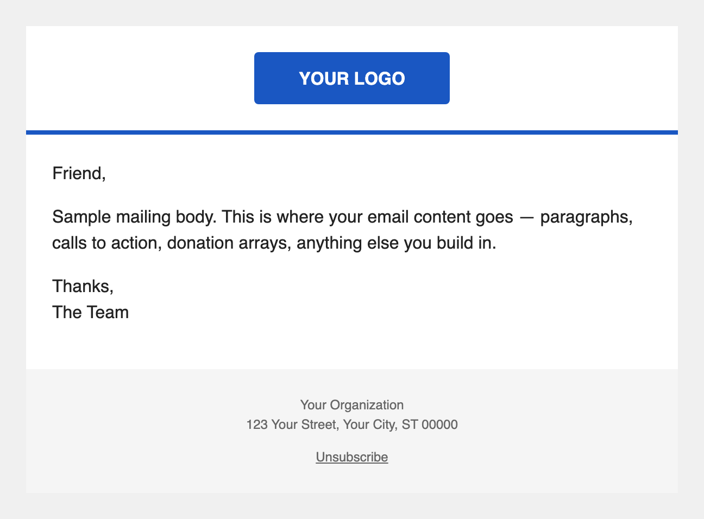

# Dark-mode-safe email wrapper

## What it is (and why it's a wrapper, not a snippet)

Email wrappers are ActionKit's way of defining the header, footer, and outer shell around every mailing. Unlike the other blocks in this repo — which are snippets you paste into a mailing body — a wrapper is installed once as an AK Email Wrapper entity and then selected on the Compose screen when you draft a mailing. Every mailing that uses the wrapper gets the same logo, accent bar, and footer automatically, without copying HTML into each draft.

This wrapper is table-based with all inline styles, and explicitly declares a light color scheme so it renders consistently in dark-mode email clients that would otherwise invert your colors.



---

## Install walkthrough (Tier 1)

1. In the AK admin, go to **Mailings tab → Email Wrappers → Add email wrapper**
2. Give your wrapper a name (e.g., "Dark-mode-safe default")
3. Copy the full HTML from `1-basic.html` into the **Template** box
4. Edit the four placeholders inline:
   - `https://example.org/logo.png` — your actual logo URL
   - `Your Organization` — your org's name (appears in logo alt text and footer)
   - `123 Your Street, Your City, ST 00000` — your org's legal mailing address
   - `#1a57c2` — your brand hex color (the accent bar under the logo)
5. Leave the **Text Template** box blank — AK generates plain-text from your HTML automatically
6. Set **Unsubscribe Text** to `` and **Unsubscribe HTML** to `` unless you have custom unsubscribe copy
7. Select the appropriate **Language**
8. Check **Is Default** if you want this to be the default wrapper for this language
9. Save
10. On the Compose screen of a mailing, select your new wrapper from the **Email wrapper** dropdown

### Preview text is included

This wrapper renders AK's built-in `{{ preview_text }}` variable in a hidden span at the top of the email — the same trick most senders use to control the inbox preview snippet in Gmail, Apple Mail, and iOS Mail. Type your preview text in the dedicated **Preview Text** field on the Compose screen (below the subject line) and AK injects it for you. No paste-in HTML needed, no Custom Mailing Field to maintain.

---

## Tier 2: Let your team edit branding without touching code

### Why you'd want this

If you're sending mailings to multiple audiences that need different logos or brand colors — say, a coalition partner has their own branding for a specific campaign — Tier 2 lets you create one wrapper template and set per-wrapper field values instead of maintaining separate copies of the HTML. You can also create multiple wrapper instances from the same template by duplicating it and filling in different field values.

### One-time setup: create these Email Wrapper Fields

**Important:** Email Wrapper Fields are a separate concept from Custom Mailing Fields (CMFs). They live on the wrapper entity itself, not on individual mailings, and they use the `wrapper_custom_fields.*` template namespace — not `custom_fields.*`. If you use `custom_fields.*` in a wrapper template, AK will silently render nothing.

To create Email Wrapper Fields: in AK admin, go to **Mailings tab → Email Wrapper Fields → Add email wrapper field**.

| Field name | Type | Suggested default |
|---|---|---|
| `brand_logo_url` | Text | Your logo URL |
| `brand_color` | Text | `#1a57c2` |
| `footer_org_name` | Text | Your org's name |
| `footer_mailing_address` | Text | Your org's mailing address |

### The HTML

```html
<!--
  Email Wrapper — Tier 2: Email Wrapper Fields (CMFs)
  Install via: Mailings tab > Email Wrappers > Add email wrapper > paste into Template box.

  IMPORTANT: Before this wrapper will work, you must create four Email Wrapper Fields on
  the wrapper itself (not Custom Mailing Fields). These use the wrapper_custom_fields.*
  namespace — NOT custom_fields.* — which is specific to Email Wrapper entities in AK.

  Required Email Wrapper Fields (all type: Text):
    - brand_logo_url         — full URL to your org's logo image
    - brand_color            — hex color for the accent bar (e.g. #1a57c2)
    - footer_org_name        — your org's display name (appears in logo alt text and footer)
    - footer_mailing_address — your org's legal mailing address

  Set field values at the bottom of the wrapper edit screen, under "Email Wrapper Field Values."
-->
<!DOCTYPE html>
<html lang="en">
<head>
  <meta charset="utf-8">
  <meta name="viewport" content="width=device-width, initial-scale=1.0">
  <meta name="color-scheme" content="light">
  <meta name="supported-color-schemes" content="light">
  <title></title>
</head>
<body style="margin: 0; padding: 0; background-color: #f0f0f0; color: #222222; -webkit-text-size-adjust: 100%; -ms-text-size-adjust: 100%;">

  <span style="display:none;font-size:0px;color:#fff;line-height:0px;max-height:0px;max-width:0px;opacity:0;overflow:hidden;">{{ preview_text }}</span>

  <!-- Outer table: full-width background -->
  <table role="presentation" cellspacing="0" cellpadding="0" border="0" width="100%" style="background-color: #f0f0f0;">
    <tr>
      <td align="center" style="padding: 24px 0;">

        <!-- Inner table: constrained to 600px -->
        <table role="presentation" cellspacing="0" cellpadding="0" border="0" width="600" style="width: 600px; background-color: #ffffff;">

          <!-- Header row: logo -->
          <tr>
            <td align="center" style="padding: 24px; background-color: #ffffff;">
              
            </td>
          </tr>

          <!-- Brand accent bar -->
          <tr>
            <td style="background-color: {{ wrapper_custom_fields.brand_color }}; height: 4px; font-size: 0; line-height: 0;">&nbsp;</td>
          </tr>

          <!-- Main content area -->
          <tr>
            <td style="padding: 24px; font-family: Helvetica, Arial, sans-serif; font-size: 16px; line-height: 1.5; color: #222222; background-color: #ffffff;">
              
            </td>
          </tr>

          <!-- Footer -->
          <tr>
            <td style="padding: 24px; font-family: Helvetica, Arial, sans-serif; font-size: 12px; line-height: 1.5; color: #666666; background-color: #f5f5f5; text-align: center;">
              <p style="margin: 0 0 12px 0;">{{ wrapper_custom_fields.footer_org_name }}<br>{{ wrapper_custom_fields.footer_mailing_address }}</p>
              <p style="margin: 0;"></p>
            </td>
          </tr>

        </table>

      </td>
    </tr>
  </table>

</body>
</html>
```

### How to install it

Same steps as the Tier 1 walkthrough above, with two differences:

- In step 3, paste from `2-with-cmfs.html` instead of `1-basic.html`
- Skip step 4 (no inline placeholders to edit) — instead, scroll to the bottom of the wrapper edit screen and fill in your field values under **Email Wrapper Field Values**

---

## Dark-mode behavior

The `<meta name="color-scheme" content="light">` and `<meta name="supported-color-schemes" content="light">` tags tell supporting clients (Apple Mail, Samsung Mail) to treat this as a light-only email and not apply automatic dark-mode inversion. All colors are set explicitly via inline styles, so there's no reliance on client defaults. Recipients who have dark mode enabled will still see the email as designed. If you want to support true dark-mode variants in the future, test both modes in Litmus or Email on Acid before shipping — the meta tags above make it easy to add a `@media (prefers-color-scheme: dark)` block later.

---

## Known compatibility

- **Outlook Windows:** table-based layout, inline styles — renders correctly
- **Outlook for Mac:** WebKit-based, renders like Apple Mail
- **Gmail web:** strips `<style>` blocks, but all styles here are inline — renders correctly
- **Apple Mail (macOS + iOS):** native rendering, dark-mode suppressed via color-scheme meta
- **Dark-mode behavior:** see section above

## Tested on

See [`tests/qa-results.md`](../../tests/qa-results.md) for the current QA matrix across every block and client. Single source of truth — this section deliberately doesn't duplicate it.

**Latest full QA run:** never. See [`tests/QA-PROCEDURE.md`](../../tests/QA-PROCEDURE.md) for how to run one.
